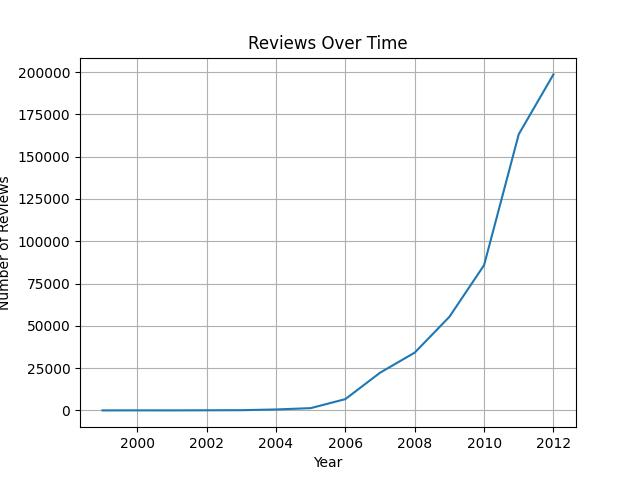
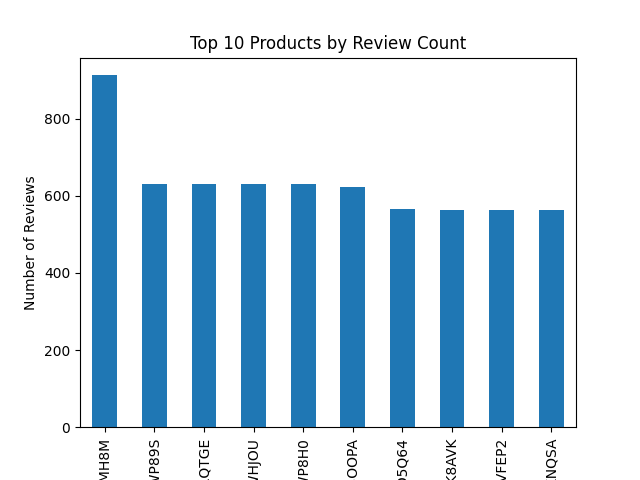
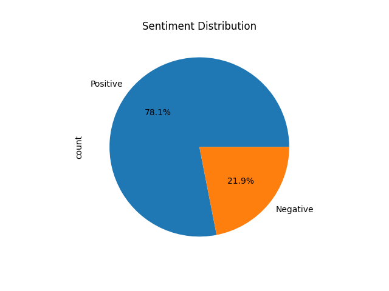

# Amazon Fine Food Reviews: Sentiment Analysis

## Project Overview

This project performs sentiment analysis on the Amazon Fine Food Reviews dataset to classify reviews as positive (scores 4-5) or negative (scores 1-2), using \~568,454 reviews from Amazon. The project involves text preprocessing, feature extraction, and training machine learning and deep learning models, achieving up to 94.92% accuracy with custom embeddings.

## Dataset

- **Source**: Amazon Fine Food Reviews on Kaggle
- **Size**: \~568,454 reviews
- **Attributes**:
  - Score (1 to 5)
  - Text (review content)
- **Sentiment Labeling**:
  - Positive: Scores of 4 or 5
  - Negative: Scores of 1 or 2
  - Neutral: Score of 3 (excluded)

## Project Structure

```
|-- data/
|   |-- Reviews.csv
|-- notebooks/
|   |-- Exploratory_Data_Analysis.ipynb
|   |-- Data_Preprocessing.ipynb
|   |-- Sentiment_Analysis_Model.ipynb
|-- src/
|   |-- download_dataset.py
|   |-- data_loader.py
|   |-- data_preprocessor.py
|   |-- sentiment_analysis.py
|-- models/
|   |-- sentiment_model.pkl
|-- README.md
|-- requirements.txt
```

## Installation

- **Set Up VS Code Environment**:

  - Install Python (3.6 or higher) from python.org.

  - Install VS Code from code.visualstudio.com.

  - Create a virtual environment:

    ```bash
    python -m venv venv
    source venv/bin/activate  # Mac/Linux
    venv\Scripts\activate     # Windows
    ```

  - Install the **Python** and **Jupyter** extensions in VS Code:

    - Go to Extensions (`Ctrl+Shift+X`) &gt; Search for “Python” and “Jupyter” &gt; Install.

  - Select the virtual environment as the Python interpreter:

    - Press `Ctrl+Shift+P` &gt; `Python: Select Interpreter` &gt; Choose the `venv` Python.

- **Install Dependencies**:

  - Install required packages:

    ```bash
    pip install -r requirements.txt
    ```

  - Packages included:

    - Core: `numpy`, `pandas`, `matplotlib`, `scikit-learn`
    - Kaggle API: `kaggle`
    - Visualization: `seaborn`
    - Notebooks: `jupyter`


## Results

The best-performing model (Custom Embeddings) achieved a test set accuracy of approximately 94.92%. The model effectively recommends top 5 products based on user data, providing insights into customer sentiment. For detailed results, refer to notebooks/Sentiment_Analysis_Model.ipynb.

## 📊 Data Insights

### Review Over Time


### Top 10 Products by Review Count


### Sentiment Distribution


## 📘 Project Summary

This project analyzes product reviews and builds a simple recommendation system.  
It includes:
- 📊 Visualizations like review trends and product rankings.

- 🤖 A recommendation model using Gradio to display results interactively.

## Acknowledgments

- Dataset: Kaggle Amazon Fine Food Reviews
- Inspired by sentiment analysis projects on Kaggle and GitHub.


## License
This project is licensed under the MIT License – see the [LICENSE](LICENSE) file for details.